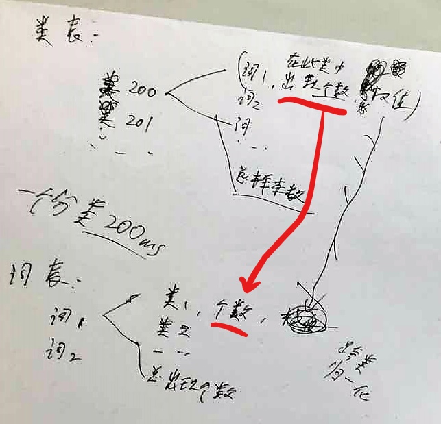

# 注意：
## 由于使用了多线程分词，现在的程序不支持在windows下运行，请使用linux或mac！
## 或者注释掉jieba.enable_parallel(2) 

---------------

# 千米题目：商品类目预测
## 思路：
由于主办方不肯给类目的中文名称以及大类的信息，所以目前想出的方法只有：

1. 聚类：
    * 采取实时聚类的方式，来一个向量，就把向量中的分词添加到子类的集合中去；
    * 若已有该词语，则将该词语的权重增加(现在的方法是增加该词在该类中出现的个数，然后对该词进行跨类归一化)，没有该词语则增加该词语并设置为最小权重；
    * 在训练时，不管一个向量中有多少个分词，该类的总样本数只加1；
    * 设置有效阈值为5%(暂定)，即当 该词在此类中出现的个数 除以 此类的总样本数 大于有效阈值时，该词在分类时才被认为是有效的，即才可以计算该词的加权得分；
    * 建议这两张表都用map，速度快。但不知道python中的map是什么。
2. 分类：
    * 预测时则根据向量中的每一个分词在各个子类中是否是有效分词，若是，才计算该向量在此类中的有效分词的加权得分之和，谁最大该向量就属于该子类。

### 问题：
1. 由于训练样本中可能会出现某个子类的样本非常多，而另一些子类的样本数非常少，这样若每次都给权重增加的是定值，就有可能会导致一个样本比较少的类，其词语又正好基本上和某个样本多的类重叠，则有可能该样本少的类中每个词语的权值都要比样本多的类低，所以在预测时可能总是被样本多的类压制，造成预测错误。所以目前想出的方案是对同一个词语在不同类中的权值归一化处理。但总感觉怪怪的，大家有时间一步步推一下，看看可不可行或应该怎么弄。
2. 原来是准备预测时也继续训练(改变权值)的，但后来想想还是算了吧，先在预测时不改变权值试试。

------------------------

>## 关键定义：
>  商品类目预测就是利用机器学习算法将用户添加商品自动划分到千米标准类目中。
>
>## 应用场景：
>  商品类目作为搜索中商品类目导航、商品推荐、各种维度数据统计、产品库建设的依据，在商品管理中占据重要的地位。千米会员在添加商品时，经常将商品的类目划分错误或者不选择类目，计算机无需人工干预或者尽量少地人工干预完成类目划分就变得很重要了。
>
>## 主要思路：
>  商品信息主要包含商品的标题、品牌、规格、属性描述等。这些信息包含中文和英文，需要对这些文本进行语言处理，提取出有意义的词汇。可能需要采用不同的算法策略，比如将聚类和分类集合起来。